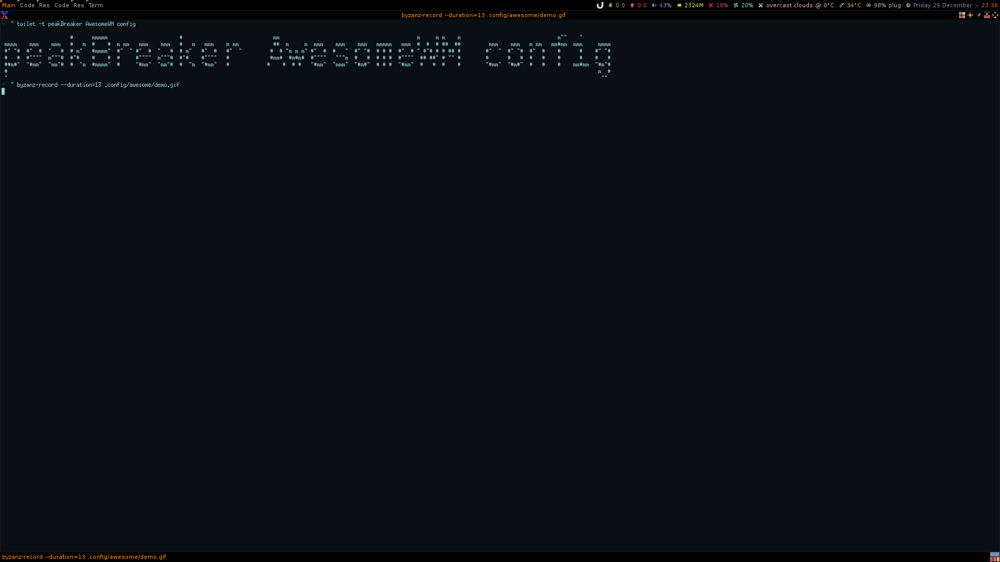
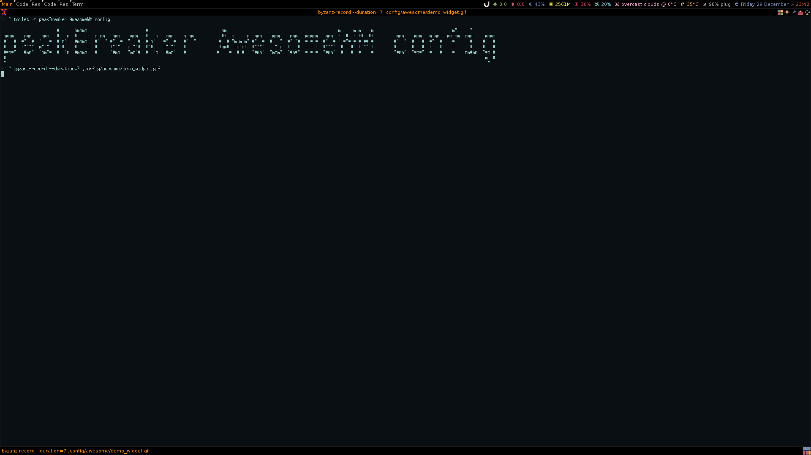

# Personal Awesome Config

I just wanted to work a bit more efficiently in my devenv, so I forked and configured my own flavor of awesome wm to fit my needs.  See below for a demo of the hotkey and shortcuts in action.



This new version now features the more full capability of awesome wm with personal keybindings (seen through mod+s) for opening various applications needed for development.  Also uses various widgets (weather, calendar and filesystem) and gives nice information about system resource use in upper tray.



## Getting started
AwesomeWM with this repo has been tested on debian 9

### Instructions
1. ```$ mkdir -p ~/.config/awesome/ ```
2. ```$ cd ~/.config/ ```
3. clone this repo ```$ git clone --recursive <this repo> ```
4. Run the install script ```$ ./install.sh```
5. Now you must select awesome as your wm when you login

Additionaly it is also still possible the change the theme in the rc.lua file, however this support may be removed in the future due to the purpose of this repo just making it easy for me personally to set up a good development environment.

## Attribution
_Credits!_

This repository is heavily based on Luca CPZs repository awesome-copycats, and has the same license. See specifications below.

* License: BY-NC-SA_
* Source: https://github.com/lcpz/awesome-copycats

You may also find his original readme in this repository

Complements are provided by lain_ and freedesktop_.

Fonts are Terminus_ (Multicolor, Powerarrow Darker), Tamzen_ (Copland), Roboto_ (Holo, Vertex) and Tamsyn_ (other ones).

Every theme has a colorscheme_.

Blackburn and Dremora use Icons_, Vertex uses FontAwesome_: be sure to have bitmaps enabled if running under Debian or Ubuntu_.

### Additional default software used:

    unclutter google-chrome scrot mpd mpc dmenu xsel

* _BY-NC-SA: http://creativecommons.org/licenses/by-nc-sa/4.0
* _b0ab0d7: https://github.com/lcpz/awesome-copycats/tree/b0ab0d7837987be81b9195a36631df773113d491
* _Awesome: http://github.com/awesomeWM/awesome
* _lucamanni: https://github.com/lucamanni/awesome
* _romockee: https://github.com/romockee/powerarrow
* _ok100: http://ok100.deviantart.com/art/DWM-January-2013-348656846
* _amouly: https://bbs.archlinux.org/viewtopic.php?pid=1307158#p1307158
* _swordfischer: https://github.com/lcpz/awesome-copycats/issues/53
* _foozer: http://dotshare.it/dots/499
* _lain: https://github.com/lcpz/lain
* _freedesktop: https://github.com/lcpz/freedesktop
* _Terminus: http://terminus-font.sourceforge.net
* _Tamzen: https://github.com/sunaku/tamzen-font
* _Roboto: https://fonts.google.com/specimen/Roboto
* _Tamsyn: http://www.fial.com/~scott/tamsyn-font
* _colorscheme: https://github.com/lcpz/dots/tree/master/.colors
* _Icons: https://github.com/lcpz/dots/tree/master/.fonts
* _Ubuntu: https://wiki.ubuntu.com/Fonts#Enabling_Bitmapped_Fonts
* _FontAwesome: https://github.com/FortAwesome/Font-Awesome
* _branches: https://github.com/lcpz/awesome-copycats/branches
